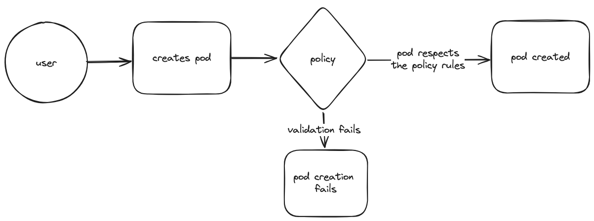

# General Aspects of Policy Engines

## What is a policy engine in Kubernetes?
In every organization, there are several standards that need to be followed when you are deploying resources
in a k8s cluster.
Such standards might include and not be limited to the name of the resource,
admission criteria, object validation or evaluation.
A solution to these existing problems can be policies, which act as the validation, evaluation or even mutation
given the standards your organization established.

### Example for policies
A simple example of how a policy can validate a resource.
A user tries to create a pod in their namespace.
Once the request is made for the API server, the admission controller captures it and compares it against the policy.
If the request for the new resource(pod) complies with the policy rules set in place,
the pod gets created.
If the request does not comply, the validation fails and the creation of the pod fails.

## Comparison of Solutions
| Tool              | OPA Gatekeeper                | Kyverno                          | Kubewarden                      | jsPolicy                                 |
|-------------------|-------------------------------|----------------------------------|----------------------------------|------------------------------------------|
| Engine Language   | GO                            | GO                               | GO                               | GO                                       |
| Admission Controller | Yes                         | Yes                              | Yes                              | Yes                                      |
| Mutating Webhook  | Yes                           | Yes                              | Yes                              | Yes                                      |
| Validation Rule Language | Rego                    | YAML/JSON                        | Any compiled to WebAssembly      | JavaScript/TypeScript                    |
| Support for Custom Resources | Yes                 | Yes                              | Yes                              | Yes                                      |
| Extensibility     | Highly Extensible             | Highly Extensible                | Highly Extensible                | Limited Extensibility                    |
| Community         | Large and Active              | Growing                          | Small and Active                 | Small and Active                         |
| Integration       | Native Integration with Kustomize and Helm | Native Integration with Kustomize and Helm | Native Integration with Open Policy Agent | Native Integration with Kubectl and Kubernetes API |
| Ease of Installation | Moderate                   | Easy                             | Moderate                         | Easy                                     |
| Package Management | Not Available                | Not Available                    | Not Available                    | npm                                      |

