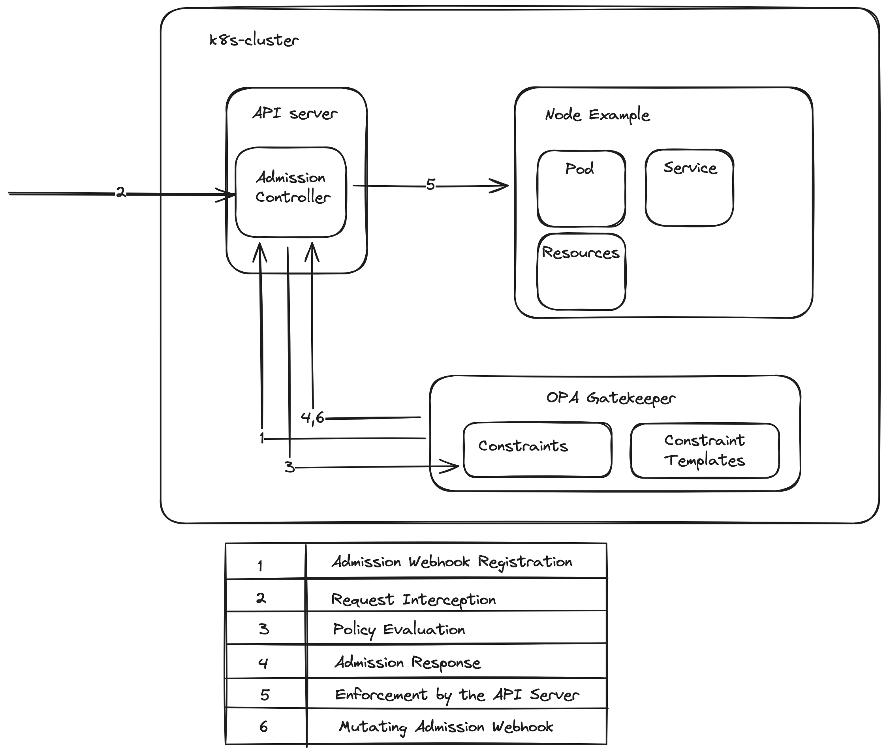

# General Aspects of Policy Engines

## What is a policy engine in Kubernetes?
In every organization, there are several standards that need to be followed when you are deploying resources
in a k8s cluster.
Such standards might include and not be limited to the name of the resource,
admission criteria, object validation or evaluation.
A solution to these existing problems can be policies, which act as the validation, evaluation or even mutation
given the standards your organization established.

## How does a policy engine work?

Kubernetes policy engines are designed to enforce specific rules and guidelines for the creation, configuration, and management of Kubernetes objects within a cluster. 
These engines enable administrators to implement and automate governance and compliance requirements across their Kubernetes environments.
An overview on how exactly a policy engine works:

* Admission Control
    * Kubernetes policy engines often integrate with the Kubernetes Admission Controllers.
      Admission Controllers are a part of the Kubernetes API server
      that intercepts requests to the Kubernetes API
      before the objects are persisted but after they are authenticated and authorized.
      Policy engines use this mechanism to evaluate the requests against the defined policies.

* Policy Evaluation
    * When a request is made to create, update, or delete a Kubernetes object,
      the policy engine evaluates the request against the set of defined policies.
      This evaluation process involves
      checking the attributes of the Kubernetes objects in the request against the conditions specified in the policies.

* Enforcement (Depending on the outcome of the policy evaluation, the policy engine enforces the policies by either)
    * Allowing the request to proceed if it complies with all the defined policies.
    * Denying the request if it violates any policy, optionally returning an error message explaining the reason for the denial.
    * Mutating the request by altering its content to make it compliant with the policies before it is processed by the Kubernetes API server.
    * Reporting and Auditing: Policy engines often provide reporting and auditing capabilities, allowing administrators to review which requests were allowed or denied and why. This helps in compliance reporting and identifying potential issues in the policy definitions or cluster usage.

* Policy Definition 
  * The first step involves defining the policies that need to be enforced. 
    Policies can cover a wide range of aspects, such as security practices, resource constraints, naming conventions, and network configurations. 
    These policies are typically defined in a declarative manner, using YAML, JSON and other formats (even language defined), which specify the rules and the actions to be taken when those rules are violated.

* Policy Storage 
  * Once defined, policies are stored in a centralized location or within the Kubernetes cluster itself. 
    This allows for easy management, versioning, and distribution of policies across the cluster or multiple clusters.

* Integration with DevOps Practices
  * Kubernetes policy engines can also be integrated into DevOps practices, particularly within Continuous Integration/Continuous Deployment (CI/CD) pipelines. 
    This allows teams to evaluate and enforce compliance of Kubernetes manifests against defined policies before these manifests are deployed to the cluster. 
    This proactive approach, often referred to as `shift-left security`, ensures that only configurations that meet the organization's policy requirements are applied, significantly reducing the risk of deploying non-compliant or potentially insecure resources.

### Example for policies
A simple example of how a policy can validate a resource.
A user tries to create a pod in their namespace.
Once the request is made for the API server, the admission controller captures it and compares it against the policy.
If the request for the new resource(pod) complies with the policy rules set in place,
the pod gets created.
If the request does not comply, the validation fails and the creation of the pod fails.

## Comparison of Solutions
| Tool              | OPA Gatekeeper                | Kyverno                          | Kubewarden                      | jsPolicy                                 |
|-------------------|-------------------------------|----------------------------------|----------------------------------|------------------------------------------|
| Engine Language   | GO                            | GO                               | GO                               | GO                                       |
| Admission Controller | Yes                         | Yes                              | Yes                              | Yes                                      |
| Mutating Webhook  | Yes                           | Yes                              | Yes                              | Yes                                      |
| Validation Rule Language | Rego                    | YAML/JSON                        | Any compiled to WebAssembly      | JavaScript/TypeScript                    |
| Support for Custom Resources | Yes                 | Yes                              | Yes                              | Yes                                      |
| Extensibility     | Highly Extensible             | Highly Extensible                | Highly Extensible                | Limited Extensibility                    |
| Community         | Large and Active              | Growing                          | Small and Active                 | Small and Active                         |
| Integration       | Native Integration with Kustomize and Helm | Native Integration with Kustomize and Helm | Native Integration with Open Policy Agent | Native Integration with Kubectl and Kubernetes API |
| Ease of Installation | Moderate                   | Easy                             | Moderate                         | Easy                                     |
| Package Management | Not Available                | Not Available                    | Not Available                    | npm                                      |

## Deep Dive to each solution
In this article, we are going to make a deep to the most popular available open-source solutions,
, including OPA Gatekeeper, Kyverno, KubeWarden, and JsPolicy.
We will start with OPA Gatekeeper,
an extension of the Open Policy Agent that provides a comprehensive framework for policy enforcement in Kubernetes,
focusing on its declarative policy language, Rego, and how it integrates with Kubernetes' Admission Controllers.
Next, we'll examine Kyverno, known for its Kubernetes-native approach and simplicity,
allowing policies to be defined as Kubernetes resources without the need to learn a new language (yaml format).
Following that, KubeWarden we will examine,
that uses WebAssembly to write and enforce policies,
offering a high degree of flexibility and security.
Lastly, we'll examine JsPolicy,
which leverages JavaScript or TypeScript for policy definition,
appealing to organizations familiar with these languages.

### OPA (Open Policy Agent) Gatekeeper
Our first deep dive into policy engines will be the most mature and widely spread used OPA Gatekeeper.
OPA is a general-purpose policy engine that means its capabilities are not limited to a Kubernetes Cluster.
Some of its use cases include microservice authorization, infrastructure, data source filtering, CI/CD pipeline polices and, of course, Kubernetes admission controller.
OPA Gatekeeper, on the other hand, is a specialized project that provides integration between OPA and Kubernetes.

Gatekeeper integrates with the Kubernetes API server through the dynamic admission control mechanism,
specifically by registering itself as a Validating and Mutating Admission Webhook.
This integration is critical for Gatekeeper
to enforce custom policies on resources as they are created or updated within the Kubernetes cluster.
Here is a summary on how this process is done:
* Admission Webhook Registration
  * When Gatekeeper is installed in a Kubernetes cluster, it registers itself with the API server as an admission webhook.
    This registration includes specifying the operations (e.g., CREATE, UPDATE), 
    and the types of resources (e.g., Pods, Services) Gatekeeper should intercept.
    This is configured in the webhook configuration object,
    which tells the Kubernetes API server
    to send certain requests to Gatekeeper for evaluation before processing them.
* Request Interception 
  * Once registered,
    the Kubernetes API server forwards relevant API requests to Gatekeeper
    before they are persisted in etcd. 
    This happens after the request has been authenticated and authorized, but `before` it is executed.
    The request is sent to Gatekeeper as an [AdmissionReview](https://open-policy-agent.github.io/gatekeeper/website/docs/input/) object,
    which includes the resource being created or modified and the operation being performed.
* Policy Evaluation
  * Upon receiving an AdmissionReview request, Gatekeeper evaluates the request against its loaded policies
    (defined as ConstraintTemplates and instantiated through Constraints). 
    Gatekeeper uses the Rego language to define these policies,
    allowing for complex logic and evaluation against the attributes of the resources included in the request.
* Admission Response 
  * After evaluating the request against the defined policies, Gatekeeper constructs an AdmissionResponse object. 
    This response indicates whether the request should be allowed or denied based on the policy evaluation.
    If the request is to be denied,
    the AdmissionResponse includes an error message explaining which policy was violated and why.
* Enforcement by the API Server
  * The Kubernetes API server receives Gatekeeper's AdmissionResponse and acts accordingly
    If the response is an "allow," the API server proceeds with processing the request,
    eventually persisting the resource in etcd.
    If the response is a "deny,"
    the API server rejects the request and returns the error message from Gatekeeper to the user,
    preventing the resource from being created or updated.
* Mutating Admission Webhook 
  * In addition to validating requests, Gatekeeper can also be configured as a mutating admission webhook,
    which allows it
    to modify requests to make them compliant with certain policies before they are processed by the API server. 
    This is a more advanced and less commonly used feature,
    as it requires careful policy design to prevent unintended modifications.

