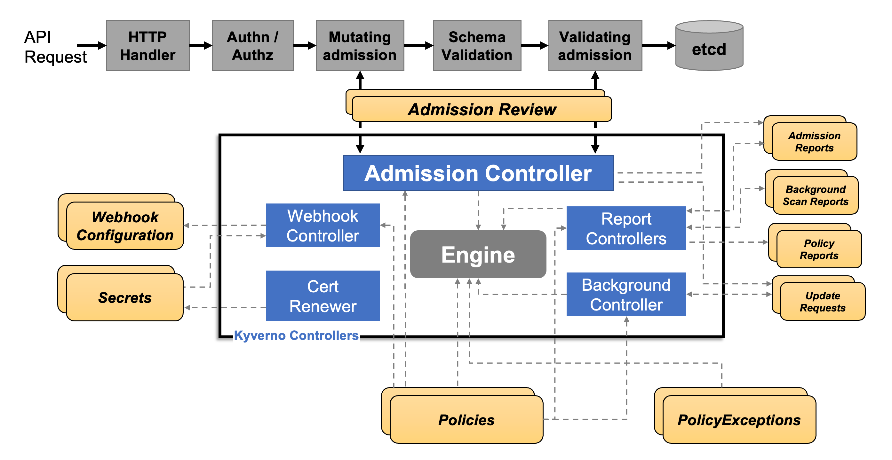

# General Aspects of Policy Engines

## What is a policy engine in Kubernetes?
In every organization, there are several standards that need to be followed when you are deploying resources
in a k8s cluster.
Such standards might include and not be limited to the name of the resource,
admission criteria, object validation or evaluation.
A solution to these existing problems can be policies, which act as the validation, evaluation or even mutation
given the standards your organization established.

## How does a policy engine work?

Kubernetes policy engines are designed to enforce specific rules and guidelines for the creation, configuration, and management of Kubernetes objects within a cluster. 
These engines enable administrators to implement and automate governance and compliance requirements across their Kubernetes environments.
An overview on how exactly a policy engine works:

* Admission Control
    * Kubernetes policy engines often integrate with the Kubernetes Admission Controllers.
      Admission Controllers are a part of the Kubernetes API server
      that intercepts requests to the Kubernetes API
      before the objects are persisted but after they are authenticated and authorized.
      Policy engines use this mechanism to evaluate the requests against the defined policies.

* Policy Evaluation
    * When a request is made to create, update, or delete a Kubernetes object,
      the policy engine evaluates the request against the set of defined policies.
      This evaluation process involves
      checking the attributes of the Kubernetes objects in the request against the conditions specified in the policies.

* Enforcement (Depending on the outcome of the policy evaluation, the policy engine enforces the policies by either)
    * Allowing the request to proceed if it complies with all the defined policies.
    * Denying the request if it violates any policy, optionally returning an error message explaining the reason for the denial.
    * Mutating the request by altering its content to make it compliant with the policies before it is processed by the Kubernetes API server.
    * Reporting and Auditing: Policy engines often provide reporting and auditing capabilities, allowing administrators to review which requests were allowed or denied and why. This helps in compliance reporting and identifying potential issues in the policy definitions or cluster usage.

* Policy Definition 
  * The first step involves defining the policies that need to be enforced. 
    Policies can cover a wide range of aspects, such as security practices, resource constraints, naming conventions, and network configurations. 
    These policies are typically defined in a declarative manner, using YAML, JSON and other formats (even language defined), which specify the rules and the actions to be taken when those rules are violated.

* Policy Storage 
  * Once defined, policies are stored in a centralized location or within the Kubernetes cluster itself. 
    This allows for easy management, versioning, and distribution of policies across the cluster or multiple clusters.

* Integration with DevOps Practices
  * Kubernetes policy engines can also be integrated into DevOps practices, particularly within Continuous Integration/Continuous Deployment (CI/CD) pipelines. 
    This allows teams to evaluate and enforce compliance of Kubernetes manifests against defined policies before these manifests are deployed to the cluster. 
    This proactive approach, often referred to as `shift-left security`, ensures that only configurations that meet the organization's policy requirements are applied, significantly reducing the risk of deploying non-compliant or potentially insecure resources.

### Example for policies
A simple example of how a policy can validate a resource.
A user tries to create a pod in their namespace.
Once the request is made for the API server, the admission controller captures it and compares it against the policy.
If the request for the new resource(pod) complies with the policy rules set in place,
the pod gets created.
If the request does not comply, the validation fails and the creation of the pod fails.

## Comparison of Solutions
| Tool              | OPA Gatekeeper                | Kyverno                          | Kubewarden                  | jsPolicy                                 |
|-------------------|-------------------------------|----------------------------------|-----------------------------|------------------------------------------|
| Engine Language   | GO                            | GO                               | GO                          | GO                                       |
| Admission Controller | Yes                         | Yes                              | Yes                         | Yes                                      |
| Mutating Webhook  | Yes                           | Yes                              | Yes                         | Yes                                      |
| Validation Rule Language | Rego                    | YAML/JSON                        | Any compiled to WebAssembly | JavaScript/TypeScript                    |
| Support for Custom Resources | Yes                 | Yes                              | Yes                         | Yes                                      |
| Extensibility     | Highly Extensible             | Highly Extensible                | Highly Extensible           | Limited Extensibility                    |
| Community         | Large and Active              | Growing                          | Small and Active            | Small and Active                         |
| Integration       | Native Integration with Open Policy Agent | Native Integration with Kustomize and Helm | Helm                        | Native Integration with Kubectl and Kubernetes API |
| Ease of Installation | Moderate                   | Easy                             | Easy                        | Easy                                     |
| Package Management | Not Available                | Not Available                    | Not Available               | npm                                      |

## Deep Dive to each solution
In this article, we are going to make a deep to the most popular available open-source solutions,
, including OPA Gatekeeper, Kyverno, KubeWarden, and JsPolicy.
We will start with OPA Gatekeeper,
an extension of the Open Policy Agent that provides a comprehensive framework for policy enforcement in Kubernetes,
focusing on its declarative policy language, Rego, and how it integrates with Kubernetes' Admission Controllers.
Next, we'll examine Kyverno, known for its Kubernetes-native approach and simplicity,
allowing policies to be defined as Kubernetes resources without the need to learn a new language (yaml format).
Following that, KubeWarden we will examine,
that uses WebAssembly to write and enforce policies,
offering a high degree of flexibility and security.
Lastly, we'll examine JsPolicy,
which leverages JavaScript or TypeScript for policy definition,
appealing to organizations familiar with these languages.

### OPA (Open Policy Agent) Gatekeeper
Our first deep dive into policy engines will be the most mature and widely spread used, OPA Gatekeeper.
OPA is a general-purpose policy engine that means its capabilities are not limited to a Kubernetes Cluster.
Some of its use cases include microservice authorization, infrastructure, data source filtering, CI/CD pipeline polices and, of course, Kubernetes admission controller.
OPA Gatekeeper, on the other hand, is a specialized project that provides integration between OPA and Kubernetes.

Gatekeeper integrates with the Kubernetes API server through the dynamic admission control mechanism,
specifically by registering itself as a Validating and Mutating Admission Webhook.
This integration is critical for Gatekeeper
to enforce custom policies on resources as they are created or updated within the Kubernetes cluster.

Here is a summary on how this process is done:
* Admission Webhook Registration
  * When Gatekeeper is installed in a Kubernetes cluster, it registers itself with the API server as an [admission webhook](https://open-policy-agent.github.io/gatekeeper/website/docs/operations/#validating-webhook).
    This registration includes specifying the operations (e.g., CREATE, UPDATE), 
    and the types of resources (e.g., Pods, Services) Gatekeeper should intercept.
    This is configured in the webhook configuration object,
    which tells the Kubernetes API server
    to send certain requests to Gatekeeper for evaluation before processing them.
* Request Interception 
  * Once registered,
    the Kubernetes API server forwards relevant API requests to Gatekeeper
    before they are persisted in etcd. 
    This happens after the request has been authenticated and authorized, but `before` it is executed.
    The request is sent to Gatekeeper as an [AdmissionReview](https://open-policy-agent.github.io/gatekeeper/website/docs/input/) object,
    which includes the resource being created or modified and the operation being performed.
* Policy Evaluation
  * Upon receiving an AdmissionReview request, Gatekeeper evaluates the request against its loaded policies
    (defined as ConstraintTemplates and instantiated through Constraints). 
    Gatekeeper uses the Rego language to define these policies,
    allowing for complex logic and evaluation against the attributes of the resources included in the request.
* Admission Response 
  * After evaluating the request against the defined policies, Gatekeeper constructs an AdmissionResponse object. 
    This response indicates whether the request should be allowed or denied based on the policy evaluation.
    If the request is to be denied,
    the AdmissionResponse includes an error message explaining which policy was violated and why.
* Enforcement by the API Server
  * The Kubernetes API server receives Gatekeeper's AdmissionResponse and acts accordingly
    If the response is an "allow," the API server proceeds with processing the request,
    eventually persisting the resource in etcd.
    If the response is a "deny,"
    the API server rejects the request and returns the error message from Gatekeeper to the user,
    preventing the resource from being created or updated.
* Mutating Admission Webhook 
  * In addition to validating requests, Gatekeeper can also be configured as a [mutating admission webhook](https://open-policy-agent.github.io/gatekeeper/website/docs/operations/#mutating-webhook),
    which allows it
    to modify requests to make them compliant with certain policies before they are processed by the API server. 
    This is a more advanced and less commonly used feature,
    as it requires careful policy design to prevent unintended modifications.

#### Pros&Cons of Gatekeeper
* Pros
  * Fine-Grained Policies
    * Gatekeeper allows for the definition of fine-grained policies using the Rego language, providing high flexibility and precision in policy enforcement. 
  * Native Kubernetes Integration 
    * As a Kubernetes-native solution, Gatekeeper seamlessly integrates with the Kubernetes ecosystem, leveraging existing components like the Admission Controller for policy enforcement. 
  * Declarative Management 
    * Policies in Gatekeeper are defined declaratively, which aligns well with Kubernetes overall design philosophy and simplifies the management of policies as code. 
  * Extensibility 
    * Through the use of ConstraintTemplates, Gatekeeper offers a highly extensible framework, allowing organizations to define custom policies that cater to their specific requirements. 
  * Community Support
    * Being part of the Open Policy Agent (OPA) project, Gatekeeper benefits from strong community support and ongoing development efforts, ensuring that it stays up-to-date with the latest in policy management and Kubernetes security trends. 
  * Audit Capability 
    * Gatekeeper provides auditing features, allowing administrators to assess historical compliance and identify resources that violate the defined policies, enhancing security and governance.
* Cons 
  * Learning Curve 
    * The need to learn Rego for policy definition can present a learning curve for users not already familiar with this language, potentially slowing down initial adoption and policy development. 
  * Maintenance Overhead 
    * Not only the learning curve can be challenging, and leading to allocation of resources to setup Gatekeeper, its maintenance will also require many team members equipped with Rego knowledge.
  * Complexity in Policy Management 
    * While the declarative nature of Gatekeeper's policies is helpful, managing a large number of complex policies can become challenging, requiring careful organization and governance.

### Kyverno
Kyverno is a policy engine designed specifically for Kubernetes, developed by [Nirmata](https://nirmata.com/).
It is recognized as an incubating project under the Cloud Native Computing Foundation (CNCF),
highlighting its growing importance and adoption within the cloud-native ecosystem.
Kyverno stands out for its Kubernetes-native approach to policy management,
allowing cluster administrators to define, manage,
and enforce policies directly on Kubernetes resources without the need to write complex code.

Kyverno [works](https://kyverno.io/docs/introduction/#how-kyverno-works) by integrating directly with the Kubernetes API to apply policies as Kubernetes resources themselves,
which simplifies the process of policy management in Kubernetes environments.
Here's an overview of how Kyverno operates within a Kubernetes cluster:
* Dynamic Admission Control 
  * Kyverno registers itself as a dynamic admission controller with the Kubernetes API server. 
    This allows Kyverno to intercept API requests, such as the creation, update, or deletion of Kubernetes resources,
    before they are processed and persisted in the cluster's etcd database. 
* Policies as Kubernetes Resources 
  * Administrators define policies using Kyverno custom resources, such as ClusterPolicy (non-namespaced) and Policy
    (namespaced). 
    These policies are written in YAML, similar to other Kubernetes resources,
    making them accessible to users familiar with Kubernetes. 
    The policies specify rules that can validate, mutate, or generate Kubernetes resources. 
  * Validation Rules 
    * Check the configuration of resources to ensure they meet certain criteria before being allowed in the cluster. 
      If a resource fails validation, the request is rejected, and an error is returned to the user. 
  * Mutation Rules 
    * Automatically modify resources as they are created or updated to ensure they comply with organizational standards or to inject certain configurations automatically. 
  * Generation Rules
    * Create additional resources based on the presence or configuration of other resources. 
      This can be useful for ensuring related resources are always deployed together. 
* Policy Matching
  * When Kyverno receives an admission review request from the Kubernetes API server, it evaluates the request against all applicable policies. 
    Policies can be scoped to apply to specific kinds of resources, namespaces, or even specific resource names, and can use label selectors for finer granularity. 
* Policy Enforcement 
  * For each matching policy, Kyverno applies the rules defined within that policy to the resource in the admission review request. 
  * If a validation rule fails, Kyverno rejects the request and returns an error explaining the violation. 
  * If a mutation rule applies, Kyverno modifies the resource in the request according to the rule and forwards the modified version to the API server for processing. 
  * If a generation rule is triggered, Kyverno creates the specified resources automatically. 
* Reporting and Feedback 
  * Kyverno generates policy reports that provide feedback on policy violations, mutations, and generated resources. 
    These reports help administrators understand the impact of policies and identify compliance issues within the cluster.

#### Pros&Cons of Kyverno
* Pros
  * No Additional Language Required
    * Policies in Kyverno are defined using YAML, which means there's no need to learn a new language for policy creation. 
      This lowers the barrier to entry for teams already familiar with Kubernetes resources and configurations.
  * Automated Resource Generation
    * Kyverno `Generation` property allows for the automatic creation of Kubernetes resources based on policy triggers.
  * Granular Exemptions 
    * Kyverno offers detailed controls for exemptions, allowing for precise and flexible policy application tailored to specific needs or exceptions within the Kubernetes environment.
  * Declarative Policy Management
    * Kyverno policies are managed as Kubernetes resources, which fits well with the Kubernetes philosophy of declarative configuration. 
      This approach enables version control of policies alongside your application code, enhancing auditability and governance
* Cons
  * Dependent on Kubernetes Versions
    * Since Kyverno relies on Kubernetes APIs and features, there may be dependencies on specific Kubernetes versions. 
      This could potentially limit the use of certain Kyverno features based on the Kubernetes version deployed.
  * The potential for Complex Policies is lower
    * As with any large system,
      there's potential to create overly complex policies that are challenging to understand and maintain. 
      This can lead to challenges in troubleshooting and could increase the risk of misconfigurations.
      Especially in the case of Kyverno, which it does not use any programming language.
  * Limited to Kubernetes 
    * As Kyverno is specifically designed for Kubernetes, its use is limited to environments where Kubernetes is the orchestration tool in use. 
      This could be a limitation for organizations using multiple or different orchestration systems.

### Kubewarden
Third in our comparison list is Kubewarden.
It is currently a CNCF sandbox project and was originally developed by [Rancher](https://www.rancher.com/about) by SUSE.
Unlike traditional policy engines that rely on domain-specific languages,
Kubewarden leverages the flexibility and security of WebAssembly (Wasm) to execute policies,
allowing developers to write policies in familiar programming languages before compiling them into Wasm modules.
This approach not only provides flexibility in policy creation, enabling more contributors within an organization,
but also ensures a high level of isolation and safety due to the sandboxed nature of WebAssembly.
As a project incubated under the CNCF,
Kubewarden is set to address the evolving needs of Kubernetes security and configuration management,
making it a compelling choice for organizations looking to enhance their Kubernetes governance with a modern,
developer-friendly solution.

How does exactly Kubewarden work?
* Installation
  * This is typically done using Helm, which will deploy the Kubewarden components as a set of Kubernetes resources. 
    These components include the Kubewarden controller and necessary Custom Resource Definitions (CRDs) for policy management.
* Integration with Admission Controllers 
  * Kubewarden operates as a dynamic admission controller within Kubernetes. 
    This means it intercepts API requests to create, update,
    or delete Kubernetes resources before they are processed by the API server.
* Policy Evaluation 
  * For each intercepted request, the Kubewarden controller invokes the relevant Wasm policy modules to evaluate the request. 
    The policies inspect the request details (such as the resource kind, metadata, and specifications) and determine whether it complies with the defined rules.
* Admission Decision 
  * Based on the evaluation, the Wasm modules return a decision to the Kubewarden controller. 
    If any policy is violated, the controller rejects the request, and it's prevented from proceeding,
    ensuring that only compliant resources are deployed or modified in the cluster.
    If the request passes all policy checks, it's allowed to proceed.
* Policy Development 
  * Developers or security engineers write policies according to the organization's requirements. 
    These policies can be about anything
    that needs to be enforced in the Kubernetes environment like ensuring only images from a trusted registry are used,
    or that all Pods must have resource limits set.
    Thanks to Kubewarden flexibility,
    these policies can be written in languages like Rust, Go,
    or others that compile to Wasm, and it also supports compatibility to Rego
    (Gatekeeper).
* Compilation 
  * Once the policies are written, they are compiled into WebAssembly (Wasm) modules. 
    This compilation step transforms the high-level policy code into a binary format
    that can be executed in a sandboxed environment,
    providing security and portability.
* Feedback and Reporting
  * Kubewarden provides detailed feedback on its policy decisions, which can be used for auditing and compliance purposes. 
    This feedback includes information on which policies were evaluated, their decisions, and any messages returned by the policies explaining their decisions.

#### Pros&Cons of Kubewarden
* Pros
  * Flexibility in Policy Development 
    * Kubewarden allows policies to be written in any programming language that compiles to WebAssembly, 
      offering flexibility and leveraging existing developer skills, 
      without the need to learn a new domain-specific language.
  * Strong Isolation with WebAssembly 
    * Policies are executed in a sandboxed environment provided by WebAssembly, 
      enhancing security by isolating the policy execution from the Kubernetes cluster
      and reducing the risk of malicious exploits.
  * Performance Efficiency 
    * WebAssembly is designed for high performance and low overhead, 
      making Kubewarden an efficient solution for policy evaluation, 
      even in high-load environments.
  * Cross-Platform Portability
    * WebAssembly ensures that policies run consistently across different environments and Kubernetes distributions, thanks to its platform-agnostic design.
  * Community and Ecosystem 
    * As part of the CNCF sandbox projects, Kubewarden benefits from community contributions, shared knowledge, and a growing ecosystem of integrations and tooling.
* Cons
  * Maturity
    * As a relatively new project, Kubewarden might not have the same level of maturity, 
      widespread adoption, or extensive documentation as more established Kubernetes policy engines,
      potentially leading to challenges in troubleshooting and community support.
  * Tooling and Integration
    * Given its unique approach using WebAssembly, the ecosystem of tools specifically designed for developing, testing,
      and debugging Kubewarden policies is still evolving. 
      This might limit some capabilities compared to more mature solutions with extensive tooling support.
  * Performance Considerations 
    * Despite WebAssembly's efficiency, the process of loading and executing Wasm 
      modules might still introduce latency in the admission control process, 
      particularly with complex policies or under high loads.

